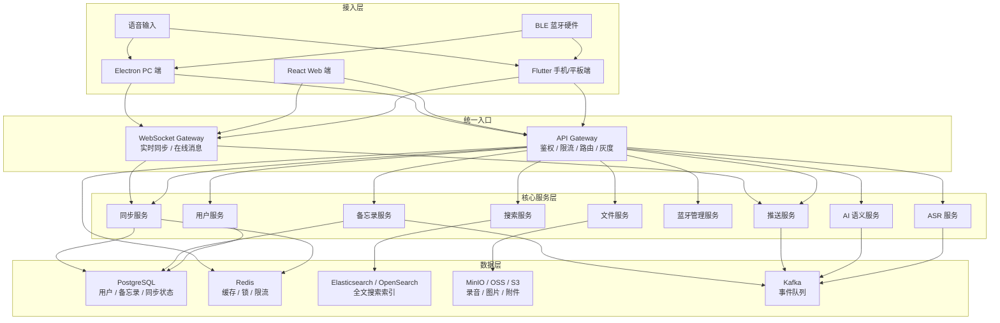
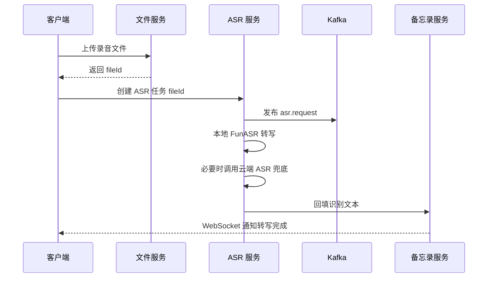
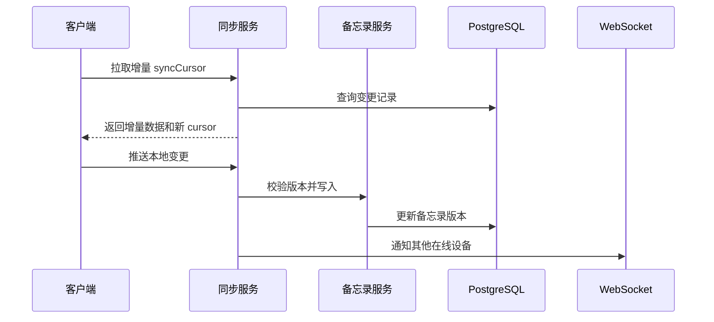

# 智能备忘录系统技术架构文档

## 1. 文档目标

本文档用于确定智能备忘录系统的核心技术选型、系统架构、服务拆分、数据存储、通信协议、AI/ASR 方案、推送方案和蓝牙协议方案。

系统目标：

- 支持手机、平板、PC、Web、蓝牙硬件和语音输入多端接入。
- 支持文字备忘、语音备忘、AI 摘要、标签分类、待办提取、全文搜索、多端同步。
- 支持本地 ASR 与云端 ASR 混合方案。
- 支持蓝牙 BLE 硬件接入和数据实时传输。
- 支持 APNs、FCM、WebSocket 和国内厂商推送扩展。
- 支持可扩展、可观测、可灰度、可私有化部署。

## 2. 技术选型结论

| 类别 | 选型 | 说明 |
| --- | --- | --- |
| 移动端 / 平板端 | Flutter + Dart | 统一开发 iOS、Android、平板端，适合快速构建多端一致体验，并支持平台插件接入录音、文件、蓝牙能力 |
| Web 端 | React + TypeScript + Vite | 用于浏览器端备忘录、管理后台、调试工具，开发效率高，生态成熟 |
| PC 端 | Electron + React + TypeScript | 用于 Windows / macOS 桌面端，便于集成系统托盘、本地文件、桌面通知、蓝牙扩展 |
| 后端主框架 | Java 21 + Spring Boot 4.x | 用于用户、备忘录、同步、推送、蓝牙管理等核心业务服务 |
| API 网关 | Spring Cloud Gateway / Kong | 统一鉴权、路由、限流、灰度、跨域和 API 版本治理 |
| AI / ASR 服务 | Python 3.11 + FastAPI | 用于封装 ASR、AI 语义处理、模型调用、异步推理任务 |
| 主数据库 | PostgreSQL 18 | 存储用户、备忘录、同步状态、版本记录；如云厂商生产环境暂未支持，可降级使用 PostgreSQL 17 |
| 缓存 | Redis 7+ | Session、Token 黑名单、热点数据、分布式锁、限流、同步游标缓存 |
| 搜索引擎 | Elasticsearch / OpenSearch | 备忘录标题、正文、标签、附件文本的全文搜索和索引管理 |
| 文件存储 | MinIO / 阿里云 OSS / AWS S3 | 存储录音、图片、附件和导出文件 |
| 消息队列 | Kafka | 处理 ASR 任务、AI 任务、同步事件、推送事件、索引更新事件 |
| ASR 方案 | FunASR 本地部署 + 云端 ASR 兜底 | 中文场景优先本地化和可控成本，云端 ASR 用于高准确率或异常兜底 |
| AI 模型 | DeepSeek API + 模型网关 | 用于摘要、标签、分类、待办提取和语义处理；模型 ID 通过配置中心管理，避免硬编码 |
| 推送方案 | APNs + FCM + WebSocket + 厂商推送扩展 | iOS 使用 APNs，海外 Android 使用 FCM，国内 Android 可扩展厂商推送，在线状态使用 WebSocket |
| 蓝牙协议 | Bluetooth LE 5.x + GATT 自定义服务 | 支持低功耗蓝牙设备扫描、配对、数据上报、指令下发、断线重连 |
| 部署 | Docker Compose / Kubernetes | 本地使用 Docker Compose，测试和生产使用 Kubernetes |
| 监控 | Prometheus + Grafana + Loki / ELK | 指标、日志、链路追踪、告警 |

## 3. 总体架构



## 4. 前端架构

### 4.1 移动端和平板端

选型：Flutter + Dart。

主要职责：

- 备忘录列表、详情、新建、编辑、删除、归档。
- 录音采集、语音上传、ASR 结果展示。
- AI 摘要、标签、待办提取结果展示。
- 蓝牙设备扫描、配对、连接、断线重连、数据接收。
- 离线缓存、同步状态展示、冲突处理。
- APNs / FCM / 厂商推送接入。

推荐模块：

| 模块 | 说明 |
| --- | --- |
| core | 网络、鉴权、配置、日志、错误处理 |
| memo | 备忘录列表、详情、编辑器 |
| voice | 录音、上传、ASR 状态 |
| ai | 摘要、标签、待办、语义搜索 |
| sync | 本地缓存、同步游标、冲突提示 |
| bluetooth | BLE 扫描、配对、连接、数据解析 |
| notification | 推送、提醒、系统通知 |

### 4.2 Web 端

选型：React + TypeScript + Vite。

主要职责：

- 浏览器端备忘录管理。
- 搜索、标签、分类、AI 摘要查看。
- WebSocket 实时同步。
- 管理后台和运维调试页面。
- 可选支持 Web Bluetooth，但不作为核心能力依赖。

### 4.3 PC 端

选型：Electron + React + TypeScript。

主要职责：

- Windows / macOS 桌面备忘录客户端。
- 支持系统托盘、全局快捷入口、本地文件拖拽、桌面通知。
- 支持蓝牙设备接入能力扩展。
- 支持离线缓存和网络恢复后增量同步。

## 5. 后端架构

### 5.1 服务拆分

| 服务 | 技术 | 主要职责 |
| --- | --- | --- |
| api-gateway | Spring Cloud Gateway | 统一鉴权、路由、限流、跨域、灰度发布 |
| user-service | Spring Boot | 用户注册登录、JWT、设备管理、权限 |
| memo-service | Spring Boot | 备忘录 CRUD、标签、分类、版本记录、软删除 |
| sync-service | Spring Boot | 增量同步、冲突检测、冲突合并、同步状态 |
| bluetooth-service | Spring Boot | 蓝牙设备档案、绑定关系、数据上报记录、设备状态 |
| push-service | Spring Boot | APNs、FCM、WebSocket、厂商推送适配 |
| file-service | Spring Boot | 文件上传、下载、鉴权、预签名链接 |
| search-service | Spring Boot | 搜索索引写入、重建、查询 |
| asr-service | Python + FastAPI | 音频转写、本地 ASR、云端 ASR 兜底 |
| ai-service | Python + FastAPI | 摘要、标签、分类、待办提取、语义处理 |

### 5.2 服务通信方式

| 场景 | 通信方式 | 说明 |
| --- | --- | --- |
| 客户端调用后端 | HTTPS REST / WebSocket | 普通接口使用 REST，实时同步和在线消息使用 WebSocket |
| 服务间同步调用 | REST / gRPC | 简单业务使用 REST，高频内部调用可使用 gRPC |
| 异步任务 | Kafka | ASR、AI、推送、搜索索引更新均走事件队列 |
| 缓存与锁 | Redis | 同步锁、限流计数、热点数据 |

## 6. 数据架构

### 6.1 数据库选型

主数据库选择 PostgreSQL 18。

选择理由：

- 支持事务、索引、JSONB、分区表，适合备忘录正文、扩展字段、同步状态等混合数据。
- 与全文搜索、向量扩展、审计数据扩展兼容性较好。
- 社区成熟，适合云上和私有化部署。

### 6.2 核心数据表

| 表名 | 说明 |
| --- | --- |
| users | 用户账号、手机号、邮箱、状态 |
| user_devices | 用户登录设备、设备类型、推送 token、最后在线时间 |
| memos | 备忘录主表，标题、正文、状态、版本号、更新时间 |
| memo_tags | 标签字典 |
| memo_tag_relations | 备忘录与标签关系 |
| memo_attachments | 图片、录音、文件附件 |
| memo_versions | 备忘录历史版本 |
| sync_states | 客户端同步游标和同步状态 |
| sync_conflicts | 同步冲突记录 |
| bluetooth_devices | 蓝牙设备档案 |
| bluetooth_bindings | 用户和蓝牙设备绑定关系 |
| push_messages | 推送任务和投递状态 |
| ai_tasks | AI 处理任务、状态、模型、成本统计 |
| asr_tasks | ASR 任务、状态、音频文件、识别文本 |

### 6.3 存储分工

| 存储 | 数据 |
| --- | --- |
| PostgreSQL | 用户、备忘录、标签、同步状态、设备绑定、任务状态 |
| Redis | Session、Token 黑名单、同步锁、限流、热点缓存 |
| Kafka | asr.request、ai.request、memo.changed、sync.changed、push.request、search.index |
| Elasticsearch / OpenSearch | 备忘录标题、正文、标签、附件文本索引 |
| MinIO / OSS / S3 | 录音、图片、附件、导出文件 |

## 7. ASR 方案

### 7.1 选型

ASR 使用混合方案：

- 主方案：FunASR 本地部署，优先服务中文普通话、中文场景和可控成本诉求。
- 兜底方案：阿里云 ASR、科大讯飞、腾讯云 ASR 等云端供应商。
- 客户端能力：移动端可优先使用平台本地转写能力，失败或准确率不足时上传服务端处理。

### 7.2 音频处理流程



### 7.3 音频格式规范

| 项目 | 规范 |
| --- | --- |
| 优先格式 | 16kHz / 16bit / mono PCM 或 WAV |
| 移动端上传 | 支持 m4a / wav / opus，服务端统一转码 |
| 流式识别 | WebSocket 分片上传，建议每片 100ms 至 500ms |
| 长音频 | 异步任务处理，客户端轮询或 WebSocket 接收状态 |
| 文件大小 | MVP 阶段单文件建议不超过 100MB |

## 8. AI 模型方案

### 8.1 选型

AI 模型使用 DeepSeek API，并通过模型网关统一调用。

设计原则：

- 不在业务代码中硬编码模型 ID。
- 模型 ID、温度、最大 token、超时、重试、降级策略均由配置中心管理。
- 摘要、标签、分类等任务优先使用非推理模型。
- 复杂冲突合并、长文本分析等任务可使用推理模型。
- 对外部模型调用记录 taskId、model、token、耗时、费用、结果摘要。

注意：DeepSeek 官方文档显示旧模型别名存在废弃时间安排，因此本项目使用模型网关和配置中心管理模型名称，避免在代码中固定 `deepseek-chat` 或 `deepseek-reasoner`。

### 8.2 AI 任务类型

| 任务 | 输入 | 输出 |
| --- | --- | --- |
| 自动摘要 | 备忘录正文 / ASR 文本 | 50 至 200 字摘要 |
| 标签推荐 | 标题、正文、历史标签 | 推荐标签列表 |
| 待办提取 | 备忘录正文 | 待办事项、时间、优先级 |
| 分类识别 | 标题、正文 | 工作、生活、学习等分类 |
| 语义搜索 | 查询词、用户上下文 | 相关备忘录 ID 列表 |
| 冲突合并建议 | 两个版本正文 | 合并建议和风险说明 |

### 8.3 AI 输出格式

AI 服务必须要求模型输出 JSON，并做 schema 校验。

示例：

```json
{
  "summary": "本次会议确认了智能备忘录 MVP 范围。",
  "tags": ["项目", "会议", "MVP"],
  "todos": [
    {
      "title": "完成接口设计",
      "dueAt": "2026-06-10T18:00:00+08:00",
      "priority": "high"
    }
  ],
  "confidence": 0.86
}
```

## 9. 推送方案

### 9.1 选型

| 端 | 方案 |
| --- | --- |
| iOS / iPadOS | APNs |
| Android 海外 | FCM |
| Android 国内 | 华为、小米、OPPO、vivo、荣耀等厂商推送扩展 |
| Web 在线消息 | WebSocket |
| PC 桌面端 | WebSocket + Electron 系统通知 |
| 浏览器离线通知 | Web Push，可作为二期能力 |

### 9.2 推送类型

| 类型 | 说明 |
| --- | --- |
| reminder | 备忘录提醒 |
| sync_changed | 多端数据变更通知 |
| asr_done | 语音转写完成 |
| ai_done | AI 摘要、标签、待办提取完成 |
| device_status | 蓝牙设备状态变化 |
| system | 系统通知 |

### 9.3 推送服务设计

- push-service 只负责消息编排和发送，不直接写业务数据。
- 所有推送请求通过 Kafka 的 `push.request` 主题进入。
- 推送 token 存储在 `user_devices` 表。
- 推送结果写入 `push_messages` 表。
- 在线用户优先使用 WebSocket，离线用户使用 APNs、FCM 或厂商推送。

## 10. 蓝牙协议方案

### 10.1 协议选型

蓝牙硬件接入采用 Bluetooth LE 5.x + GATT 自定义服务。

原因：

- 低功耗，适合录音笔、按钮、耳机、可穿戴设备等场景。
- 移动端支持较成熟。
- 支持设备发现、配对、连接、数据通知、指令写入。

### 10.2 GATT 服务设计

| 项目 | 说明 |
| --- | --- |
| Service UUID | 自定义智能备忘录服务 UUID |
| Device Info Characteristic | 设备型号、固件版本、电量、能力集 |
| Command Characteristic | 客户端向设备写入指令 |
| Data Notify Characteristic | 设备向客户端通知数据 |
| Status Characteristic | 连接状态、录音状态、错误码 |
| OTA Characteristic | 二期支持固件升级 |

### 10.3 数据帧格式

建议使用紧凑二进制帧，payload 可采用 CBOR 或 TLV。

```text
| magic | version | seq | type | flags | timestamp | payloadLength | payload | crc16 |
```

字段说明：

| 字段 | 说明 |
| --- | --- |
| magic | 固定魔数，用于识别协议 |
| version | 协议版本 |
| seq | 递增序号，用于去重和重传 |
| type | 数据类型，如音频片段、按钮事件、设备状态 |
| flags | 是否压缩、是否加密、是否最后一片 |
| timestamp | 设备侧时间戳 |
| payloadLength | payload 长度 |
| payload | 实际数据 |
| crc16 | 校验码 |

### 10.4 蓝牙安全要求

- 设备绑定必须经过用户确认。
- 支持 BLE bonding，敏感数据开启链路加密。
- 服务端记录设备 SN、MAC 摘要、用户绑定关系。
- 设备数据上报必须带 seq，避免重放。
- 敏感 payload 可增加应用层 AES-GCM 加密和 HMAC 校验。

## 11. 同步架构

### 11.1 同步模型

采用增量同步 + 版本号 + 冲突记录模型。

核心字段：

| 字段 | 说明 |
| --- | --- |
| memoId | 备忘录 ID |
| userId | 用户 ID |
| version | 服务端版本号 |
| clientVersion | 客户端本地版本号 |
| updatedAt | 服务端更新时间 |
| deletedAt | 软删除时间 |
| syncCursor | 客户端同步游标 |

### 11.2 同步流程



### 11.3 冲突策略

| 场景 | 策略 |
| --- | --- |
| 不同字段编辑 | 自动合并 |
| 正文同时编辑 | 生成冲突记录，给出 AI 合并建议 |
| 一端删除一端编辑 | 保留删除记录，客户端提示用户恢复或确认删除 |
| 附件冲突 | 保留两个附件版本 |

## 12. 安全架构

| 项目 | 方案 |
| --- | --- |
| 登录认证 | JWT Access Token + Refresh Token |
| API 鉴权 | Spring Security Resource Server |
| 传输安全 | 全站 HTTPS / WSS |
| 文件访问 | 预签名 URL + 权限校验 |
| 敏感字段 | 数据库字段加密 |
| 密钥管理 | 环境变量 / KMS / Secret Manager |
| 接口防护 | 限流、IP 黑名单、验证码、风控 |
| 审计 | 登录、删除、导出、设备绑定等操作记录审计日志 |

## 13. 部署架构

### 13.1 本地开发

- 使用 Docker Compose 启动 PostgreSQL、Redis、Kafka、Elasticsearch、MinIO。
- 前端本地启动，后端本地或容器启动。
- AI / ASR 服务支持本地模型和模拟供应商。

### 13.2 测试和生产

- 服务容器化部署到 Kubernetes。
- API Gateway 暴露公网入口。
- 内部服务仅允许集群内访问。
- 数据库、Redis、Kafka、对象存储建议使用云托管或高可用集群。
- 监控、日志、告警必须随服务同时上线。

## 14. 可观测性

| 类型 | 指标 |
| --- | --- |
| API | QPS、P95/P99 延迟、错误率、限流次数 |
| ASR | 成功率、平均耗时、失败供应商、音频时长 |
| AI | token 消耗、调用成本、成功率、超时率 |
| 同步 | 同步失败率、冲突数量、平均同步延迟 |
| 推送 | 发送成功率、到达率、失败原因 |
| 蓝牙 | 连接成功率、断线次数、数据丢包率 |
| 存储 | 数据库连接数、慢查询、Redis 命中率、ES 索引延迟 |

## 15. 参考资料

- Flutter 官方文档：https://docs.flutter.dev/
- React 官方文档：https://react.dev/
- Spring Boot 官方文档：https://docs.spring.io/spring-boot/
- Spring Cloud Gateway 官方文档：https://docs.spring.io/spring-cloud-gateway/reference/
- PostgreSQL 当前官方文档：https://www.postgresql.org/docs/current/
- FunASR 官方仓库：https://github.com/modelscope/FunASR
- DeepSeek API 文档：https://api-docs.deepseek.com/
- Firebase Cloud Messaging 文档：https://firebase.google.com/docs/cloud-messaging
- Apple 远程通知文档：https://developer.apple.com/documentation/usernotifications/setting-up-a-remote-notification-server
- Bluetooth Core Specification：https://www.bluetooth.com/specifications/specs/core-specification/
- Android BLE 文档：https://developer.android.com/develop/connectivity/bluetooth/ble/ble-overview

